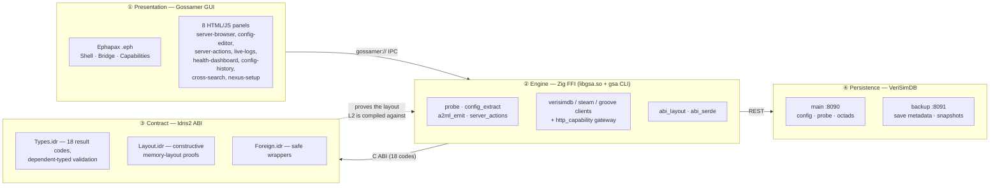
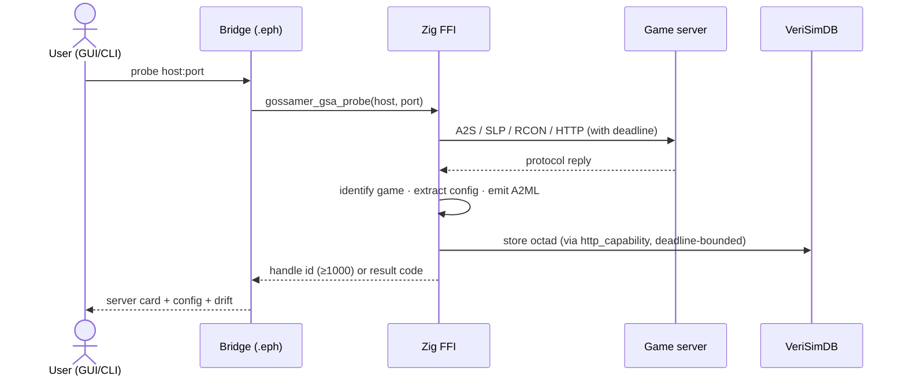

<!-- SPDX-License-Identifier: CC-BY-SA-4.0 -->
<!-- SPDX-FileCopyrightText: 2026 Jonathan D.A. Jewell <j.d.a.jewell@open.ac.uk> -->

# Architecture

GSA is four layers, each with a narrow, typed contract to the next. The design
principle: **push correctness down to where it can be proven, and keep every
boundary explicit.**

## The layers

### ① Gossamer GUI — `src/core/`, `src/gui/`
The user-facing shell. **Ephapax** `.eph` modules (`Shell`, `Bridge`,
`Capabilities`) define the IPC contract and lifecycle; the actual UI is 8
fat `panel.html` files driven by FLI widgets. Ephapax's *linear types* guarantee
GUI handles (webview, channels, capabilities) are consumed exactly once — that
is the whole reason the presentation layer is written in Ephapax and not JS.
The GUI reaches the engine over the `gossamer://` IPC bridge; Gossamer loads
`libgsa` via `dlopen` at runtime.

### ② Zig FFI — `src/interface/ffi/`
The load-bearing engine and the one artifact you can run standalone (`gsa`
CLI + `libgsa.so`, 40 exported `gossamer_gsa_*` symbols). It owns:
- **probing** (`probe.zig`) — 5 protocols, DNS/IPv6, per-probe deadlines;
- **config extraction** (`config_extract.zig`) — 8 formats → flat typed fields;
- **A2ML** (`a2ml_emit.zig`) — serialise/parse/diff with secret redaction;
- **server actions** (`server_actions.zig`) — Podman/Docker/systemd, local or SSH, injection-hardened;
- **outbound HTTP** (`http_capability.zig`) — one deadline-enforcing gateway for the VeriSimDB/Steam/Groove clients;
- **the binary ABI** (`abi_layout.zig`, `abi_serde.zig`) — extern structs pinned to the proven Idris layout.

See [`docs/developer/FFI-MODULE-REFERENCE.adoc`](../developer/FFI-MODULE-REFERENCE.adoc).

### ③ Idris2 ABI — `src/interface/abi/`
The **specification**, with proofs. `Types.idr` carries the domain model with
dependent-typed validation (`ValidPort`, `NonEmpty`, `ValidConfig`) and the
18-variant `Result`. `Layout.idr` proves each wire struct's field offsets don't
overlap and are aligned — *zero postulates, all constructive*. `Foreign.idr`
wraps the raw C calls with the linear ServerHandle protocol. A code generator
lifts these facts into Zig so the compiler enforces them (see
[The Proven ABI](05-The-Proven-ABI.md)).

### ④ VeriSimDB — `container/verisimdb/`, `container/verisimdb-backup/`
Two dedicated instances: **main** (`:8090`) for server config, probe data and
8-modality octads; **backup** (`:8091`) for game-save metadata and restore
points. GSA is a *client* — the DB server itself is built from an external
source at container-build time.

## Data flow: a probe-to-store round-trip

## External dependencies (and graceful degradation)

| Dependency | GSA assumes | Without it |
|---|---|---|
| **Gossamer** | loads `libgsa` via dlopen; `gossamer://` IPC | CLI still works; GUI won't launch |
| **Ephapax** | compiles the `.eph` sources | CLI unaffected; GUI can't be built (2/25 chain tests blocked on parser gaps) |
| **VeriSimDB** | REST client to `:8090` | probing/config work; storage/drift return `verisimdb_unavailable` |
| **Groove** | HTTP voice/text alerts | alerts are best-effort; core unaffected |
| **panic-attack / standards** | CI lint + reusable workflows | local dev unaffected; CI degrades gracefully |

The rule of thumb: **anything you can do without a GUI, the `gsa` CLI can do
today.** Anything that needs the webview or live drift needs the estate running.

→ Next: [Installation](03-Installation.md)
