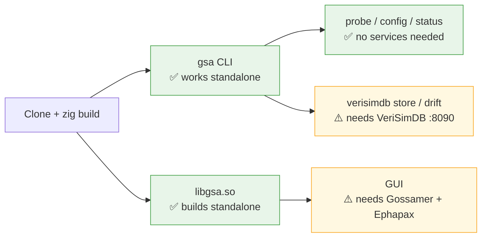

<!-- SPDX-License-Identifier: CC-BY-SA-4.0 -->
<!-- SPDX-FileCopyrightText: 2026 Jonathan D.A. Jewell <j.d.a.jewell@open.ac.uk> -->

# Installation

**Read this whole page before you start.** GSA is alpha and part of a larger
estate. This guide is deliberately blunt about what will and won't work so your
first hour is spent on the right things.

## What actually works today



- ✅ **The `gsa` CLI** — `status`, `probe`, `profiles`, `config`, `steam`,
  `version`. Builds and runs from just this repo.
- ✅ **`libgsa.so`** — the shared library, standalone.
- ⚠️ **VeriSimDB-backed features** (store, query, drift) need a VeriSimDB
  instance on `:8090`. Without it they return `verisimdb_unavailable` — by
  design, not a crash.
- ⚠️ **The GUI** needs the Gossamer webview shell and the Ephapax toolchain,
  which live in sibling repos. If you don't have the estate, **stop at the
  CLI** — it does the interesting work.

## Prerequisites

| Tool | Version | Why | Get it |
|---|---|---|---|
| **Zig** | `0.15.2` (exact — see `.tool-versions`) | builds the FFI + CLI | <https://ziglang.org/download/> |
| **just** | any recent | task runner (`just run …`) | <https://github.com/casey/just> |
| **Podman** | any recent | container ops (never Docker in this estate) | distro package |
| Idris2 | `0.7.x` (optional) | type-check the ABI locally | not in apt; use the `idris2-pack` image (CI does) |
| Gossamer + Ephapax | estate | GUI only | estate repos (not public-installable yet) |

> **Zig version is not negotiable.** The FFI uses 0.15-specific stdlib APIs
> (`std.Io.Writer.Allocating`, the `fetch` shape, `Thread.Semaphore.timedWait`).
> 0.14 or 0.16 will not compile. `zig version` must print `0.15.2`.

## Build & run the CLI

```bash
git clone https://github.com/hyperpolymath/game-server-admin
cd game-server-admin/src/interface/ffi

zig build                 # builds libgsa.so, libgsa.a, and the gsa CLI
```

From the repo root:

```bash
just run version                 # print version (0.9.0)
just run profiles                # list the 18 supported games
just run probe play.example.com  # fingerprint a server (DNS + IPv6 ok)
just run probe 10.0.0.5 27015    # explicit port
just run status                  # system status + VeriSimDB health + profiles
```

Or call the binary directly: `src/interface/ffi/zig-out/bin/gsa probe <host>`.

## Verify your build

```bash
cd src/interface/ffi
zig build test              # 94 unit tests
zig build test-integration  # 41
zig build test-behavioral   # 10 (real sockets + the C-ABI + HTTP deadline)
zig build test-cli test-smoke test-property   # 3 + 5 + 14
zig build fuzz              # config-parser fuzz seed corpus
```

All green ⇒ your toolchain is correct. If `test-property` or `fuzz` fail to
*compile*, you are almost certainly not on Zig 0.15.2.

## Configuration (environment)

| Variable | Default | Meaning |
|---|---|---|
| `GSA_VERISIMDB_URL` | `http://localhost:8090` | main VeriSimDB endpoint |
| `GSA_BACKUP_VERISIMDB_URL` | `http://localhost:8091` | backup (save metadata) |
| `GSA_PROFILES_DIR` | `./profiles` | game-profile directory |
| `GSA_STEAM_API_KEY` | — | required for `gsa steam …` (get one at steamcommunity.com/dev/apikey) |

The CLI's own config lives in `user-config.ncl` — create it with
`gsa config init`, then `gsa config set-default <host> <port>` /
`gsa config add-favorite <name> <host> <port>`.

## Running the backing store (optional)

VeriSimDB runs as a Podman **quadlet**. See [Deployment Topology](08-Deployment-Topology.md)
for the full container story. Short version: the `container/verisimdb/`
`Containerfile` builds the server from an external source and the
`gsa-verisimdb.container` quadlet runs it on `:8090`. Until it's up,
`gsa status` will show VeriSimDB as `FAIL` — that's expected, not a bug.

## The honest expectations list

- The **probe engine works against real servers** — DNS/IPv6, the A2S challenge
  handshake, framed Minecraft SLP. If a probe fails, [Troubleshooting](09-Troubleshooting.md)
  has the usual causes (firewall, wrong port, query port ≠ game port).
- The **GUI is not one-click installable** outside the estate yet. This is the
  single biggest source of "nothing works": people expect a desktop app and hit
  the Gossamer/Ephapax dependency. Use the CLI.
- A few **v1.0 gates are open** (CryoFall game-file staging, an OpenSSF badge,
  the Bitbucket mirror). None of them block CLI use.

→ Next: [Probing & Games](04-Probing-and-Games.md) · stuck? → [Troubleshooting](09-Troubleshooting.md)
