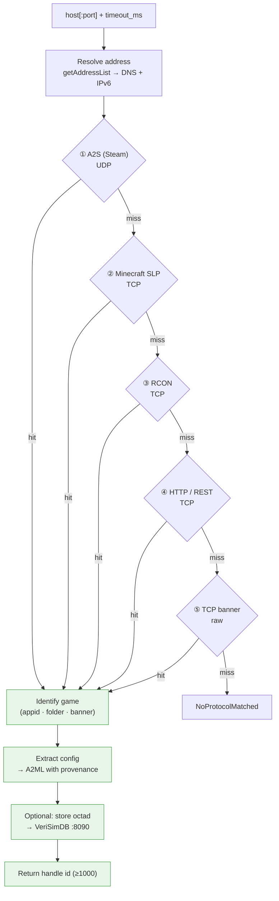

<!-- SPDX-License-Identifier: CC-BY-SA-4.0 -->
<!-- SPDX-FileCopyrightText: 2026 Jonathan D.A. Jewell <j.d.a.jewell@open.ac.uk> -->

# Probing & Games

Probing is the thing GSA does that nothing else in the estate does: you hand it
a `host[:port]` and it works out **what game is running there** without you
telling it. This page is how that works and what it supports.

## The probe pipeline



Every probe is **deadline-bounded** — the `timeout_ms` you pass is threaded all
the way down into each per-protocol attempt (a silent server returns in ~your
budget, not the old hardcoded 3 s). Addresses are resolved through
`getAddressList`, so DNS names and IPv6 literals both work.

## The five protocols (priority order)

Probes run cheapest-and-widest first; the first hit wins.

| # | Protocol | Transport | Detects | Notes |
|---|---|---|---|---|
| 1 | **A2S** (Valve/Steam query) | UDP | Most Steam-listed servers | Full `0x41` challenge handshake — re-queries with the token, so modern Source servers don't silently fail |
| 2 | **Minecraft SLP** | TCP | Minecraft Java/Bedrock | VarInt-framed read loop — reassembles a reply split across packets |
| 3 | **RCON** | TCP | Source RCON admin port | Handshake only (no auth) to fingerprint |
| 4 | **HTTP / REST** | TCP | Web-admin & REST servers (e.g. Terraria) | Banner + status probe |
| 5 | **TCP banner** | TCP | Anything with a greeting | Last-resort raw grab |

The two historical probe bugs — the unhandled A2S challenge and the truncated
single-`read()` SLP parse — are both fixed and pinned by behavioral tests that
run real sockets against in-process mock servers (see
[Contributing](10-Contributing.md#tests)).

## Supported games (18)

Each game ships an A2ML **profile** in `profiles/` declaring its ports, probe
protocol, config format, fingerprint (Steam appid / executable), container
actions, and a config schema. GSA supports **quoted and unquoted** attribute
values in these profiles.

| Game | Probe protocol | Config format |
|---|---|---|
| ARK: Survival Evolved | A2S | INI |
| Barotrauma | A2S | XML |
| Burble | WebRTC | TOML |
| CryoFall | custom (automaton) | XML |
| Counter-Strike 2 | A2S | key-value |
| DayZ | A2S | XML |
| Don't Starve Together | A2S | INI |
| Factorio | custom TCP + RCON | JSON |
| Garry's Mod | A2S | Lua |
| IDApTIK | WebSocket | A2ML |
| Minecraft: Bedrock Edition | Minecraft query | key-value |
| Minecraft: Java Edition | Minecraft query | key-value |
| Project Zomboid | A2S | INI |
| Rust | A2S | key-value |
| Starbound | custom TCP | JSON |
| Terraria | REST API | key-value |
| Valheim | A2S | env |
| Void Expanse | custom | XML |

> The table is generated from the real `profiles/*.a2ml` files. A2S covers the
> majority; the "custom" rows are servers that don't answer a standard query
> protocol and are identified by a game-specific handshake or the known-port
> table.

## What a profile looks like

A profile is compact and declarative. Abridged Valheim:

```
@game-profile(id="valheim", name="Valheim", engine="Unity"):
  @ports:
    @port(name="query", number=2457, protocol="UDP"): Steam A2S query @end
    @port(name="game",  number=2456, protocol="UDP"): Game traffic     @end
  @end
  @protocol(type="steam-query", variant="A2S"): … @end
  @fingerprint:
    @steam-appid(server=896660, client=892970) @end
    @executable(name="valheim_server.x86_64") @end
  @end
  @config(format="env", path="/config/valheim/server.env"):
    @field(key="SERVER_PASS", type="secret", label="Server Password"):
      @constraint(min-length=5) @end
    @end
  @end
  @actions: @action(id="restart"): podman restart -t 30 valheim @end … @end
@end
```

Fields typed `secret` are **redacted to `[REDACTED]`** everywhere GSA emits them
(A2ML output, octad JSON) — never printed, never stored in the clear.

## Adding a game

Drop a new `profiles/<game>.a2ml` following the shape above. See
[`docs/developer/CONFIG-FORMATS.adoc`](../developer/CONFIG-FORMATS.adoc) for the
config-format side and the README's "Adding a Game Profile" snippet for the
minimum viable profile.

→ Next: [The Proven ABI](05-The-Proven-ABI.md) · deploying? → [Deployment Topology](08-Deployment-Topology.md)
