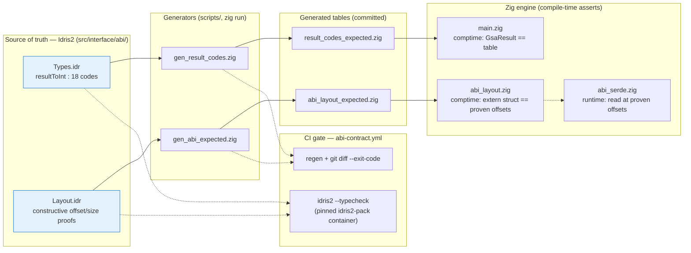
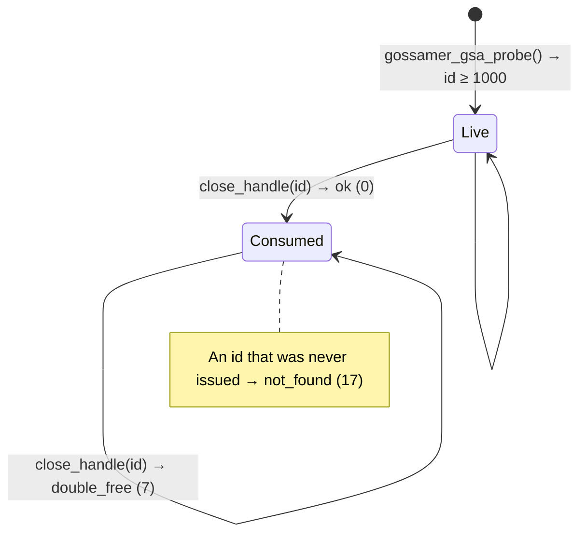

<!-- SPDX-License-Identifier: CC-BY-SA-4.0 -->
<!-- SPDX-FileCopyrightText: 2026 Jonathan D.A. Jewell <j.d.a.jewell@open.ac.uk> -->

# The Proven ABI

This is GSA's differentiator, so it's worth being precise about what it means.

**Claim:** every value that crosses the Zig↔Idris2 boundary — result codes,
struct field offsets, handle lifecycle — is governed by a contract that is
**checked by a machine, at compile time, in CI**. Not "documented and hopefully
kept in sync." Checked.

That distinction matters because the honest history here is that the contract
*was* out of sync — Zig result codes 5–12 meant different things from the Idris
codes with the same numbers, `close_handle` was a no-op, and 124 green tests
sailed right past it because nothing ever compiled the two sides against each
other. The fix wasn't "be more careful." It was to make drift a **build
failure**.

## How the contract is enforced

The Idris2 model is the **single source of truth**. Code generators lift its
facts into Zig, and the Zig compiler refuses to build if reality has drifted
from the model.

Three independent locks, so no single edit can quietly break the contract:

1. **Comptime cross-check.** `main.zig` asserts at compile time that its
   `GsaResult` enum has exactly the same cardinality and values as the table
   generated from `Types.idr`. A mismatched or missing variant is a
   `@compileError`, not a runtime surprise.
2. **CI regen + diff.** `abi-contract.yml` re-runs the generators and does
   `git diff --exit-code`. If you edited `Types.idr` or `Layout.idr` without
   regenerating, CI is red.
3. **Idris type-check.** The same job type-checks the Idris model in a pinned
   `idris2-pack` container. Idris's total, exhaustive matches mean a forgotten
   result-code case won't even compile — the proof obligations are real.

`Layout.idr`'s offset and alignment facts are **constructive proofs with zero
postulates** (e.g. `alignUpCeil` + `alignUpCeilIsMultiple`, not a `believe_me`).
`abi_serde.zig` then reads/writes at exactly those proven offsets, so the layout
isn't just asserted at compile time — it's the live wire format at runtime.

## The 18 result codes

One enum, byte-for-byte identical in `main.zig` (`GsaResult`) and `Types.idr`
(`Result` / `resultToInt`):

| Code | Name | Meaning |
|---|---|---|
| 0 | `ok` | Success. The only non-failure value. |
| 1 | `err` | Generic/unclassified failure. |
| 2 | `invalid_param` | A caller argument failed validation. |
| 3 | `out_of_memory` | Allocation failed. |
| 4 | `null_pointer` | A required pointer argument was null. |
| 5 | `already_consumed` | A linear handle was used after being consumed. |
| 6 | `resource_leaked` | A handle was dropped without being closed. |
| 7 | `double_free` | A handle was closed twice. |
| 8 | `probe_timeout` | A probe or HTTP call hit its deadline. |
| 9 | `connection_refused` | The target refused the connection. |
| 10 | `auth_failed` | Authentication was rejected. |
| 11 | `config_parse_error` | Config extraction failed to parse. |
| 12 | `verisimdb_unavailable` | VeriSimDB was unreachable (graceful degrade). |
| 13 | `not_initialized` | Called before `gossamer_gsa_init`. |
| 14 | `protocol_error` | A protocol reply was malformed. |
| 15 | `io_error` | Underlying I/O failure. |
| 16 | `permission_denied` | The OS or policy denied the operation. |
| 17 | `not_found` | No such handle/resource. |

### Codes vs handles — a disjoint space

`0` means success; any **positive** code (1–17) means failure. Functions like
`gossamer_gsa_probe` that hand back a resource return a **handle id ≥ 1000**
(`FIRST_HANDLE_ID`). Because the code space (0–17) and the handle space (≥1000)
never overlap, a successful handle can *never* be misread as an error code —
which is exactly the confusion the old contract allowed.

> The full per-symbol reference is in
> [`docs/developer/FFI-MODULE-REFERENCE.adoc`](../developer/FFI-MODULE-REFERENCE.adoc).

## The linear handle lifecycle

Idris `Foreign.idr` models a `ServerHandle` as a **linear** resource — the type
system there proves a well-typed caller uses it exactly once. The Zig runtime
enforces the same protocol for the C-ABI callers that don't have that type
system:

- First `close_handle` → `ok`.
- Second `close_handle` on the same id → `double_free` (7).
- `close_handle` on an id that was never issued → `not_found` (17).

This is verified end-to-end by the C-ABI behavioral test
(`init → probe → close → double-close`), the single highest-value test in the
suite — it exercises the actual returned values through the real exported
symbols, which is where the original bugs hid.

→ Next: [HTTP Capability Gateway](06-HTTP-Capability-Gateway.md)
