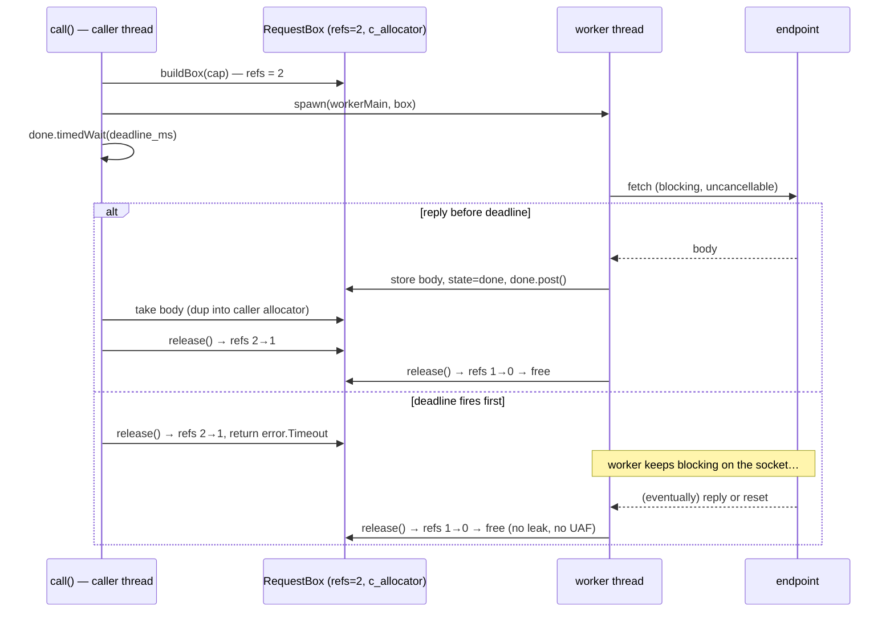

<!-- SPDX-License-Identifier: CC-BY-SA-4.0 -->
<!-- SPDX-FileCopyrightText: 2026 Jonathan D.A. Jewell <j.d.a.jewell@open.ac.uk> -->

# HTTP Capability Gateway

GSA makes outbound HTTP calls to three places: VeriSimDB (`:8090`), the Steam
Web API, and Groove (voice/text alerts). Every one of those calls goes through a
**single** module — `src/interface/ffi/src/http_capability.zig` — and none of
them can be made any other way. This page is why that exists and what it buys
you.

## The problem it solves

Zig 0.15.2's `std.http.Client.fetch` has **no timeout** and owns its own socket.
A hung endpoint therefore blocked the calling thread *forever*, and the
`STEAM_API_TIMEOUT_MS` / `GROOVE_TIMEOUT_MS` constants that claimed to bound it
were inert. That's a real availability bug: one unresponsive dependency freezes
the caller.

## The estate direction

The wider estate has an **`http-capability-gateway`** whose thesis is: *HTTP
verbs and routes become declared capabilities, not accidents.* One policy layer
mediates traffic with **default-deny** and a `narrative` explaining every
decision. GSA applies the same idea to its **outbound** side. Each call site
doesn't just "do a GET" — it declares a capability:

```zig
const resp = try http_capability.call(allocator, .{
    .verb       = .GET,
    .url        = url,
    .host_allow = &.{"api.steampowered.com"}, // default-deny everything else
    .deadline_ms = 5000,                       // a HARD wall-clock bound
    .purpose    = "resolve Steam vanity URL",  // the narrative
    .label      = "steam.resolveVanity",       // the capability name
    .trust      = .internal,                    // SafeTrust axis
});
```

The field names deliberately mirror the gateway's DSL, so the two read the same.

| Field | Mirrors (gateway) | Meaning in GSA |
|---|---|---|
| `verb` | governance verbs | HTTP method |
| `host_allow` | route allow-listing | exact set of authorities this call may reach — **default-deny** |
| `deadline_ms` | `max_latency_ms` | a **hard** wall-clock deadline (clamped to a sane floor/ceiling) |
| `purpose` | `narrative` | human-readable intent, logged on denial/timeout |
| `label` | `capability` | the capability's name |
| `trust` | SafeTrust total order | `untrusted < authenticated < internal` |

Two properties fall straight out of this:

- **Default-deny.** `call()` checks the URL's authority against `host_allow`
  *before opening a socket*. A non-allow-listed host returns `HostNotAllowed`
  with **no connection attempted** — verified by a test that starts no mock and
  asserts no socket is opened. Host matching is port-qualified: a bare host
  (`localhost`) matches any port; a qualified entry (`localhost:8090`) must
  match exactly.
- **Every call is bounded.** No caller can forget the timeout, because the
  timeout is the API.

## How the deadline is enforced

`fetch` can't be cancelled (no fd access in 0.15.2), so the deadline bounds the
**caller's** latency with a worker thread and a counted handoff:



The shared `RequestBox` is backed by `std.heap.c_allocator` (malloc — thread-safe
and process-lifetime), never a transient allocator, so a worker that outlives a
timed-out caller can still touch the box safely. Ownership is a 2-count refcount;
**whichever of {caller, worker} releases last frees the box.** That's correct for
both the fast-success path and the timeout path — no write-after-free, no leak
(confirmed under `testing.allocator`'s leak detector, with `waitQuiescent()`
draining abandoned workers before the check).

A bounded `MAX_OUTSTANDING` (64) cap fails fast with `Backpressure` instead of
letting blocked worker threads pile up — the client-side echo of the gateway's
circuit breaker.

## What a timeout becomes

A deadline hit surfaces to callers as `probe_timeout` (code 8); other failures
keep their existing result codes. Crucially, **no new `GsaResult` variant** was
needed, so this whole capability layer required **zero** `Types.idr` / ABI regen
— it sits entirely inside the engine, beneath the proven boundary.

## Known limit (documented in-module)

A blocked `fetch` cannot be *truly* cancelled in 0.15.2 — the deadline bounds the
caller's latency, not the worker's socket occupancy. `MAX_OUTSTANDING` bounds how
far that can accumulate. Actively unblocking would require a hand-rolled HTTP+TLS
client, which is out of scope for now. This is stated honestly in the module and
in [PR #63](https://github.com/hyperpolymath/game-server-admin/pull/63).

→ Next: [GUI & Nexus Setup](07-GUI-and-Nexus-Setup.md)
