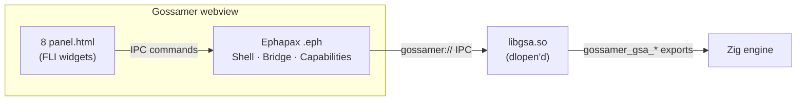
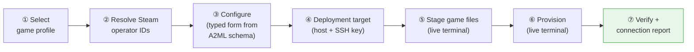

<!-- SPDX-License-Identifier: CC-BY-SA-4.0 -->
<!-- SPDX-FileCopyrightText: 2026 Jonathan D.A. Jewell <j.d.a.jewell@open.ac.uk> -->

# GUI & Nexus Setup

> **Read this first:** the GUI needs the **Gossamer** webview shell and the
> **Ephapax** toolchain, which live in sibling estate repos. If you only have
> this repo, the GUI won't launch — but everything it does is also reachable from
> the `gsa` CLI. See [Installation](03-Installation.md#the-honest-expectations-list).
> This page documents the GUI as designed and built; it's not yet one-click
> installable outside the estate.

## How the GUI is wired

The GUI is a **Gossamer** webview that loads `libgsa` via `dlopen` at runtime and
talks to it over the `gossamer://` IPC bridge. The presentation logic is written
in **Ephapax** (`.eph`) — a linearly-typed language whose whole point here is that
GUI handles (the webview, IPC channels, capabilities) are *consumed exactly once*,
so a use-after-free of a UI resource is a compile-time impossibility, not a
runtime crash.

Each panel is a fat `panel.html` driven by FLI widgets, registered in
`panels/manifest.json` (which declares `gossamer://gsa/*` data-sources mapping to
IPC endpoints), and backed by a clade in `panel-clades/`. The manifest carries the
SSOT version (`0.9.0`) and SPDX `AGPL-3.0-or-later`. To build your own panel, see
[`docs/developer/PANEL-EXTENSION-GUIDE.adoc`](../developer/PANEL-EXTENSION-GUIDE.adoc).

## The eight panels

| Panel | What it does | Backed by (engine) |
|---|---|---|
| **server-browser** | List & probe servers; the entry surface | `probe`, `list_servers` |
| **config-editor** | Typed form over the A2ML config schema | `extract_config`, `apply_config` |
| **config-history** | Temporal versions + roll back a config | VeriSimDB `history` |
| **cross-search** | Search across servers/configs | VeriSimDB `query` |
| **health-dashboard** | Live health of servers + VeriSimDB | `verisimdb_health`, probes |
| **live-logs** | Streaming server logs (WS) | `get_logs` |
| **server-actions** | Start/stop/restart/backup | `server_action` |
| **nexus-setup** | 7-step new-server provisioning wizard | see below |

## Nexus Setup — the provisioning wizard

`nexus-setup` is the newest and highest-value panel: a **7-step graphical wizard**
that deploys a managed game server end-to-end. It mirrors `scripts/wizard.sh`
entirely in the GUI, with full typed form support generated from the game's A2ML
profile.

| Step | IPC command | Notes |
|---|---|---|
| 1. Select game profile | `list_profiles` | pick one of the 18 games |
| 2. Resolve operator IDs | `steam_resolve_vanity` (per slot) | vanity URL → SteamID64; `steam_player_info` for names |
| 3. Configure server | *(profile schema)* | form is generated from the profile's `@config` fields; secrets are masked |
| 4. Deployment target | — | host + SSH key for the remote |
| 5. Stage game files | `nexus_stage_files` | live terminal output (SteamCMD etc.) |
| 6. Provision | `nexus_provision` | live terminal output |
| 7. Verify | `nexus_verify` | probes the new server and prints a connection report |

Steps 5–6 stream a live terminal so a long SteamCMD download or a provisioning
run is visible, not a spinner. Step 2's Steam calls go out through the
[HTTP Capability Gateway](06-HTTP-Capability-Gateway.md), so they're deadline-
bounded and host-restricted to `api.steampowered.com`.

> The wizard is a **shipped feature**. If you can't run the GUI yet, the same
> flow exists as `scripts/wizard.sh` and the underlying `gsa` CLI subcommands.

→ Next: [Deployment Topology](08-Deployment-Topology.md)
