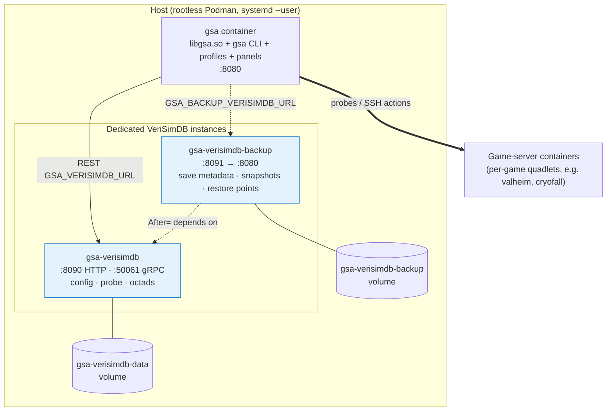

<!-- SPDX-License-Identifier: CC-BY-SA-4.0 -->
<!-- SPDX-FileCopyrightText: 2026 Jonathan D.A. Jewell <j.d.a.jewell@open.ac.uk> -->

# Deployment Topology

How GSA runs in containers. Everything here is **Podman + quadlets + Chainguard
Wolfi** — this estate never uses Docker or `Dockerfile`. The container image is
built with a `Containerfile`, and services are declared as systemd **quadlet**
`.container` units, not `docker run` scripts.

## The runtime picture



## The two VeriSimDB instances

They are **dedicated and separate** — GSA data never lives in the VeriSimDB
source repo, and the two roles never share a store.

| Instance | Port | Quadlet | Stores |
|---|---|---|---|
| **main** | `[::1]:8090` (HTTP) + `:50061` (gRPC) | `container/verisimdb/gsa-verisimdb.container` | server config, probe data, 8-modality octads |
| **backup** | `[::1]:8091` → container `:8080` | `container/verisimdb-backup/gsa-verisimdb-backup.container` | game-save metadata, snapshots, restore-point provenance, live-vs-save drift |

Both bind **localhost / IPv6 only** (`[::1]`), run **read-only rootfs** with a
`tmpfs` for `/tmp`, and carry a 15 s health check that matches the drift-detection
interval. The backup unit declares `After=gsa-verisimdb.service`, so it starts
after main.

Point GSA at them with the environment variables (see
[Installation](03-Installation.md#configuration-environment)):

```
GSA_VERISIMDB_URL=http://[::1]:8090
GSA_BACKUP_VERISIMDB_URL=http://[::1]:8091
```

## Installing a quadlet

Quadlets are systemd-native — no compose runtime needed:

```bash
# Copy the unit into the user quadlet directory
cp container/verisimdb/gsa-verisimdb.container ~/.config/containers/systemd/
systemctl --user daemon-reload
systemctl --user start gsa-verisimdb

# Verify
podman ps | grep gsa-verisimdb
curl -sf http://[::1]:8090/health
```

The same pattern applies to `gsa-verisimdb-backup` and to the per-game units
(e.g. `container/cryofall/gsa-cryofall.container`).

## Building the image

```bash
podman build -t gsa:latest -f container/Containerfile .
```

The `Containerfile` is a two-stage build on `cgr.dev/chainguard/wolfi-base`:
stage 1 compiles `libgsa.so` with Zig; stage 2 packages it with the game
profiles, GUI panels, and the Gossamer entry point. `entrypoint.sh` execs `gsa`.
It expects `gsa-verisimdb` reachable on `:8090` (override with
`GSA_VERISIMDB_URL`).

## The `container/` directory

| Path | What |
|---|---|
| `container/Containerfile` | the main two-stage GSA image |
| `container/entrypoint.sh` | execs the `gsa` binary |
| `container/verisimdb/` | main-instance quadlet + `config.a2ml`, `schema/`, `queries/*.vcl` |
| `container/verisimdb-backup/` | backup-instance quadlet (game saves) |
| `container/cryofall/` | example per-game quadlet + `Settings.xml` + backup script |
| `container/compose.toml`, `compose.example.toml` | compose reference (quadlets are canonical) |
| `container/deploy.k9.ncl` | Nickel deployment descriptor |

## Nix / Guix

Both `flake.nix` and `guix.scm` carry **real** build/install phases (not stubs),
so GSA can also be built reproducibly outside containers.

## Reality check

Standing up the full topology means running two VeriSimDB instances *and*, for
the GUI, the estate's Gossamer/Ephapax stack. If something's not up, GSA degrades
gracefully rather than crashing — `gsa status` will show VeriSimDB as `FAIL` and
storage calls return `verisimdb_unavailable`, but probing and config extraction
keep working. When it doesn't degrade gracefully, that's a bug — take it to
[Troubleshooting](09-Troubleshooting.md).

→ Next: [Troubleshooting](09-Troubleshooting.md)
