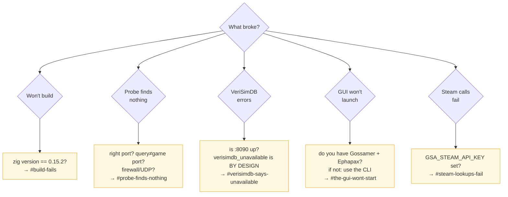

<!-- SPDX-License-Identifier: CC-BY-SA-4.0 -->
<!-- SPDX-FileCopyrightText: 2026 Jonathan D.A. Jewell <j.d.a.jewell@open.ac.uk> -->

# Troubleshooting

Let's be honest: GSA is alpha and part of a multi-repo estate, so the first-run
experience has sharp edges. This page exists so that when something doesn't work
— and on a fresh install, something probably will — you can tell *which* of a
small number of known things it is, and fix it in minutes instead of giving up.

**The single most common problem** is expecting a one-click desktop app and
hitting the GUI's estate dependencies. If that's you, jump to
[The GUI won't start](#the-gui-wont-start). Otherwise, start here:

## Start here — the triage flow



## Build fails

| Symptom | Cause | Fix |
|---|---|---|
| `zig build` errors on stdlib APIs (`Io.Writer.Allocating`, `Semaphore.timedWait`, `fetch` shape) | Wrong Zig version | `zig version` **must** print `0.15.2`. 0.14/0.16 use different stdlib APIs and will not compile. See `.tool-versions`. |
| `test-property` or `fuzz` fail to *compile* | Almost always the wrong Zig, again | Same fix — pin 0.15.2. A compile failure here is the canary. |
| Idris2 step fails locally | Idris2 isn't in apt | Don't build it locally; CI type-checks the ABI in the pinned `idris2-pack` container. Local Idris is optional. |
| `panic-attack: command not found` | It's an estate tool, not always present | Fine locally — CI is the real gate (`static-analysis-gate.yml` / `governance.yml`). |

Sanity check your toolchain by running the suites (all green ⇒ you're good):

```bash
cd src/interface/ffi
zig build test test-integration test-behavioral test-cli test-smoke test-property
```

## Probe finds nothing

`gsa probe <host>` returning nothing usually isn't a GSA bug — it's the network.
Work down this list:

| Check | Why it bites |
|---|---|
| **Query port ≠ game port** | Most games listen for A2S on a *separate* query port (Valheim: game 2456, **query 2457**). Probe the query port. |
| **UDP blocked** | A2S is UDP. Home routers and cloud firewalls often drop inbound UDP silently. |
| **Wrong port entirely** | Pass the explicit port: `gsa probe 10.0.0.5 27015`. |
| **Server not actually up** | `nc -vz host port` (TCP) or check the container: `podman ps`. |
| **Timeout too tight** | A distant server may need more than a small budget; the default is generous, but a custom low `timeout_ms` can cut it off. |
| **Genuinely unsupported protocol** | The 5 probes (A2S/SLP/RCON/HTTP/TCP) cover most games; a truly exotic server returns `NoProtocolMatched`. |

If a **modern Source server** used to fail and now works after an update — that
was the A2S `0x41` challenge handshake, now handled. If a **Minecraft** reply was
truncated — that was the single-`read()` SLP bug, now a framed read loop. Both are
fixed and regression-tested.

## VeriSimDB says "unavailable"

This is the one people misread as a crash. **It isn't.**

- `gsa status` showing VeriSimDB `FAIL`, or storage/drift calls returning
  `verisimdb_unavailable` (code 12), is **graceful degradation by design** when no
  instance is on `:8090`. Probing and config extraction still work without it.
- To actually run it, bring up the quadlet (see
  [Deployment Topology](08-Deployment-Topology.md)):

  ```bash
  cp container/verisimdb/gsa-verisimdb.container ~/.config/containers/systemd/
  systemctl --user daemon-reload && systemctl --user start gsa-verisimdb
  curl -sf http://[::1]:8090/health
  ```
- Check `GSA_VERISIMDB_URL` matches where it's actually listening (default
  `http://localhost:8090`; the quadlet binds `[::1]` — IPv6 localhost).
- If a call **hangs then returns** `probe_timeout` instead of hanging forever,
  that's the [HTTP Capability Gateway](06-HTTP-Capability-Gateway.md) deadline
  doing its job against an unresponsive endpoint.

## The GUI won't start

This is **the** big one — the honest "nothing works" moment.

- The GUI is a **Gossamer** webview compiled with **Ephapax**, both of which live
  in sibling estate repos. **If you don't have the estate, the GUI cannot launch
  yet.** This is a known limitation, not a misconfiguration on your side.
- **What to do instead:** use the `gsa` CLI. Everything the GUI does — probe,
  config extract/apply, status, actions, the provisioning wizard
  (`scripts/wizard.sh`) — is reachable from the command line today.
- If you *do* have the estate and the GUI still won't build, the current known
  blocker is the Ephapax parser (2 of 25 Gossamer chain tests fail on parser gaps
  for `;`, zero-arg calls, and lambda blocks). That's tracked upstream in the
  Ephapax repo, not here.

> Bottom line: if your expectation was a downloadable desktop app, reset it to
> "a working CLI plus a GUI that needs the estate." The CLI is the product you
> can run today.

## Steam lookups fail

| Symptom | Fix |
|---|---|
| `gsa steam …` returns `auth_failed` or empty | Set `GSA_STEAM_API_KEY` (get one at <https://steamcommunity.com/dev/apikey>). |
| Steam call times out | It's deadline-bounded to `api.steampowered.com`; a timeout maps to `probe_timeout`. Check outbound network / proxy. |
| A non-Steam host is "denied" | Default-deny: the gateway only permits declared hosts. That's intentional. |

## Server actions (start/stop/logs) fail

| Symptom | Cause | Fix |
|---|---|---|
| `permission_denied` on an action | Podman/systemd perms or SSH | Confirm the container exists (`podman ps -a`); for remote actions, check the SSH key/user. |
| Action seems to do nothing | Wrong container name in the profile | The profile's `@action` commands reference a fixed container name (e.g. `valheim`); match it to your deployment. |
| Odd characters in a config value rejected | Input validation, on purpose | `profile_id` is charset-restricted and configs are XML-escaped to block injection — see the security hardening in `server_actions.zig`. |

## Still stuck?

1. Re-run `gsa status` — it prints the whole system's health in one shot.
2. Grab the last error with `gossamer_gsa_last_error` (the CLI surfaces it).
3. Confirm your toolchain with the six test suites above.
4. Open an issue with: `zig version`, the exact command, and `gsa status` output.

Nothing here should silently swallow a failure — if GSA *crashes* rather than
returning a result code, that's a real bug worth reporting.

→ Next: [Contributing](10-Contributing.md)
