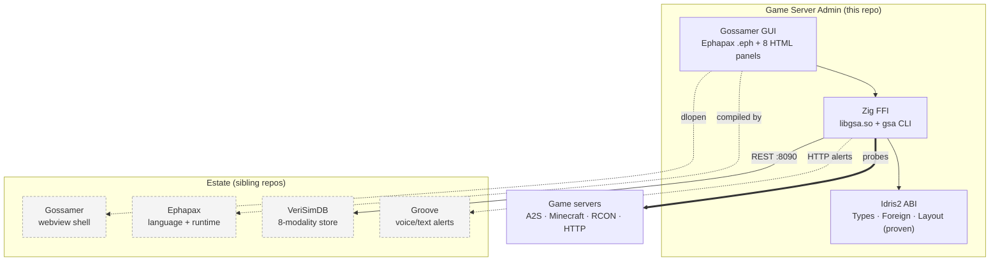

<!-- SPDX-License-Identifier: CC-BY-SA-4.0 -->
<!-- SPDX-FileCopyrightText: 2026 Jonathan D.A. Jewell <j.d.a.jewell@open.ac.uk> -->

# Game Server Admin — Wiki

**GSA** is a universal game-server **probe**, **configuration manager**, and **administration** tool. Point it at a host and it fingerprints what game is running, extracts and version-tracks the server's config, and gives you a GUI (and CLI) to start/stop/restart/back-up the server — across 18 games and 8 config formats.

> **Status: `0.9.0`, alpha.** The engine (probing, config extraction, the proven ABI, container ops) is real and tested (167 automated tests). The full GUI stack depends on sibling repos in the wider estate (see [Architecture](02-Architecture.md)), and a handful of v1.0 gates are still open. **Read [Installation](03-Installation.md) and [Troubleshooting](09-Troubleshooting.md) before you expect a one-click experience** — this page is honest about what works today.

GSA is deliberately the **client half** of a multi-repo ecosystem: it *orchestrates* Gossamer, Ephapax, VeriSimDB and Groove but does not contain them. The Zig CLI (`gsa`) works standalone; the GUI needs the estate.

## Start here

| If you want to… | Read |
|---|---|
| Understand what GSA is and how the layers fit | [Architecture](02-Architecture.md) |
| Install and run it | [Installation](03-Installation.md) |
| Probe a server / see supported games | [Probing & Games](04-Probing-and-Games.md) |
| Understand the "proven ABI" (the differentiator) | [The Proven ABI](05-The-Proven-ABI.md) |
| Know how outbound HTTP is governed | [HTTP Capability Gateway](06-HTTP-Capability-Gateway.md) |
| Use the GUI / deploy a new server | [GUI & Nexus Setup](07-GUI-and-Nexus-Setup.md) |
| Run it in containers | [Deployment Topology](08-Deployment-Topology.md) |
| Fix something that's broken | [Troubleshooting](09-Troubleshooting.md) |
| Contribute code | [Contributing](10-Contributing.md) |

## The one-paragraph tour

You give GSA a `host[:port]`. Its **probe engine** ([Probing & Games](04-Probing-and-Games.md)) tries A2S (Steam), Minecraft SLP, RCON, HTTP and a raw TCP banner in priority order, resolving DNS/IPv6 and honouring a per-probe timeout. On a hit it identifies the game, extracts the config (one of 8 formats) into **A2ML** with provenance, and can store an 8-modality *octad* in **VeriSimDB** for drift detection. Every value crossing the Zig↔Idris2 boundary rides a **machine-checked ABI contract** ([The Proven ABI](05-The-Proven-ABI.md)); every outbound HTTP call is a **declared capability** with an enforced deadline ([HTTP Capability Gateway](06-HTTP-Capability-Gateway.md)). Server lifecycle actions run through Podman/Docker/systemd, locally or over SSH — with the exec boundary hardened against injection.

## Reference documentation

The wiki is the narrative, illustrated tour. For dense reference material see the developer/maintainer docs (indexed in [`docs/INDEX.adoc`](../INDEX.adoc)):

- [`docs/developer/FFI-MODULE-REFERENCE.adoc`](../developer/FFI-MODULE-REFERENCE.adoc) — every module + exported symbol + the 18 result codes
- [`docs/developer/ARCHITECTURE-RATIONALE.adoc`](../developer/ARCHITECTURE-RATIONALE.adoc) — *why* Ephapax/Idris2/Zig/VeriSimDB
- [`docs/developer/PANEL-EXTENSION-GUIDE.adoc`](../developer/PANEL-EXTENSION-GUIDE.adoc) — add a GUI panel
- [`docs/developer/CONFIG-FORMATS.adoc`](../developer/CONFIG-FORMATS.adoc) — the 8-format parser
- [`docs/maintainer/RELEASE-CHECKLIST.adoc`](../maintainer/RELEASE-CHECKLIST.adoc) · [`CI-CD-GUIDE.adoc`](../maintainer/CI-CD-GUIDE.adoc) · [`SECURITY-SCANNING-RUNBOOK.adoc`](../maintainer/SECURITY-SCANNING-RUNBOOK.adoc)
